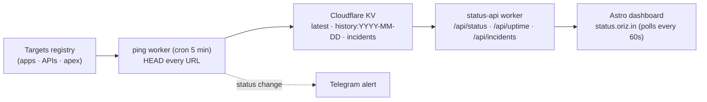

# oriz-status

**Custom uptime + status page for the oriz.in fleet — Cloudflare Workers cron + KV, Astro static front-end.**

[](LICENSE)
[](https://github.com/chirag127/oriz-status/stargazers)
[](https://github.com/chirag127/oriz-status/commits)
[](https://astro.build/)
[](https://github.com/chirag127/oriz-status/actions/workflows/deploy.yml)

A self-hosted status page and uptime monitor for the ~80-site oriz.in family, built to
replace UptimeRobot after its commercial-use ban. A Cloudflare Worker cron HEAD-pings
every app, API and the apex domain on a schedule, rolls results into KV, and a second
Worker serves the aggregated status/uptime as JSON. An Astro static site renders the
public dashboard.

- **Live site:** https://status.oriz.in
- **GH Pages landing:** https://chirag127.github.io/oriz-status/
- **Repo:** https://github.com/chirag127/oriz-status

⭐ If this is useful, please **star the repo** — it helps others find it.

## Architecture



## Features

- **5-minute cron probe** — HEAD-pings every target (apps + APIs + apex); records
  latest state and rolls daily history into KV.
- **Status API** — `/api/status`, `/api/uptime?slug=<slug>&days=30`, `/api/incidents`
  served from KV with edge caching.
- **Public dashboard** — Astro static site, auto-refreshes client-side every 60s;
  RSS feed at `/feed.xml`.
- **Incident tracking** — last 50 incidents kept in KV; Telegram alert on any status
  change.
- **Optional watchlist** — Clerk SSO gates only a personal watchlist; the public
  status page needs no login.

## Tech stack

- [Astro 6](https://astro.build/) static + [React 19](https://react.dev/) islands
- [Cloudflare Workers](https://developers.cloudflare.com/workers/) (cron + API) + KV
- [Wrangler](https://developers.cloudflare.com/workers/wrangler/) for deploys
- Fonts via `@fontsource-variable/*`; optional [Clerk](https://clerk.com/) +
  [Firebase](https://firebase.google.com/) Firestore for the watchlist
- Package manager: pnpm 10 (Node ≥ 22)

## Repo structure

```
oriz-status/
├─ src/                       # Astro dashboard
│  ├─ pages/                 #   public status page
│  ├─ components/             #   status UI
│  └─ lib/siteConfig.ts       #   site config
├─ workers/                   # Cloudflare Workers
│  ├─ ping-cron.ts            #   5-min cron: HEAD-ping targets → KV, alert on change
│  ├─ status-api.ts           #   /api/status · /api/uptime · /api/incidents
│  ├─ targets.ts              #   the monitored URL registry
│  ├─ wrangler.ping.toml       #   ping worker config
│  └─ wrangler.api.toml        #   api worker config
├─ package.json
└─ .github/workflows/         # deploy.yml · megalinter.yml
```

## Screenshots

_Live status board at [status.oriz.in](https://status.oriz.in)._

> _Screenshot placeholder — add `public/screenshot.png` once captured._

## Quick start

```bash
pnpm install
pnpm dev                    # local dev server (astro dev)
pnpm build                  # static build → dist/
pnpm deploy:pages           # deploy dashboard → Cloudflare Pages
pnpm deploy:worker:ping     # deploy the cron ping worker
pnpm deploy:worker:api      # deploy the status API worker
pnpm deploy:all             # build + all three
```

> On Windows, if a pnpm build fails on the esbuild binary, use
> `npm install --legacy-peer-deps && npm run build`.

## API reference

Served by the `status-api` worker (base `https://status-api.oriz.in`):

| Endpoint | Purpose |
|---|---|
| `GET /api/status` | Current state of every monitored target |
| `GET /api/uptime?slug=<slug>&days=30` | Rolling uptime history for one target |
| `GET /api/incidents` | Recent incidents (last 50) |

## Configuration

Public, client-exposed env vars only (`PUBLIC_*`). Names + purpose — **never commit values**:

| Variable | Purpose |
|---|---|
| `PUBLIC_STATUS_API_BASE` | Base URL of the status API worker |
| `PUBLIC_BASE_PATH` | Astro base path (subpath deploys) |
| `PUBLIC_CLERK_PUBLISHABLE_KEY` | Clerk publishable key (watchlist SSO) |
| `PUBLIC_FIREBASE_API_KEY` | Firebase web API key (Firestore only) |
| `PUBLIC_FIREBASE_AUTH_DOMAIN` | Firebase auth domain |
| `PUBLIC_FIREBASE_PROJECT_ID` | Firebase project id |
| `PUBLIC_FIREBASE_STORAGE_BUCKET` | Firebase storage bucket |
| `PUBLIC_FIREBASE_MESSAGING_SENDER_ID` | Firebase messaging sender id |
| `PUBLIC_FIREBASE_APP_ID` | Firebase app id |

Worker secrets (KV bindings, Telegram token) live in Wrangler/CF secrets and a
sops + age vault — never in the repo. No `PUBLIC_*_SECRET`.

## Part of the oriz family

One of ~80 sites in the [oriz](https://blog.oriz.in) family — a solo-run fleet of
finance tools, blogs, and utilities. It runs **$0 on the Cloudflare free tier**:
~65 fetches per 5-minute tick × 288 ticks/day ≈ 18.7k outbound fetches/day, well under
the Workers Free 100k/day limit.

## Contributing

Issues and PRs welcome. Conventional commits — they **are** the changelog.

## License

MIT © Chirag Singhal — chirag@oriz.in

## Status / roadmap

Production — replaced UptimeRobot for the fleet. Roadmap: latency percentiles,
public incident timeline, per-target SLA badges.
